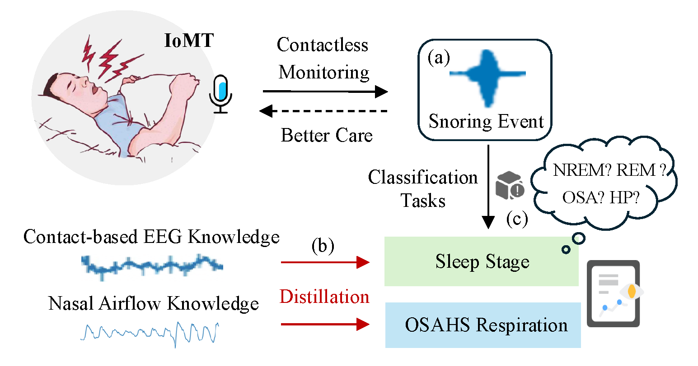

# SnoreSleep

This is the official project page for the IEEE Internet of Things Journal (IoTJ) paper:

**Contactless OSAHS Respiration and Sleep Stage Classification using Monitored Snoring Events with Heterogeneous Multiscale Selective Distillation for Internet of Medical Things**

## Overview

<p align="center">
  
</p>

<p align="center">
  <em>
  Snore-based sleep monitoring system for IoMT.
  (a) Data sources: contactless snoring events for inference; NaA and EEG as gold-standard signals.
  (b) Model distillation: heterogeneous physiological knowledge is distilled into snoring event classification models.
  (c) Output tasks: the models enable accurate, contactless, snore-only inference for OSAHS respiration and sleep stage classification tasks.
  </em>
</p>

## 📄 Citation

Please cite the paper using the following BibTeX entry:


```bibtex
@article{yu2026Snore,
  title={Contactless OSAHS Respiration and Sleep Stage Classification using Monitored Snoring Events with Heterogeneous Multiscale Selective Distillation for Internet of Medical Things},
  author={Yu, Zhen and Zhang, Shaoxing and Liu, Yang and Chen, Qingchao},
  journal={IEEE Internet of Things Journal},
  year={2026},
  publisher={IEEE}
}
